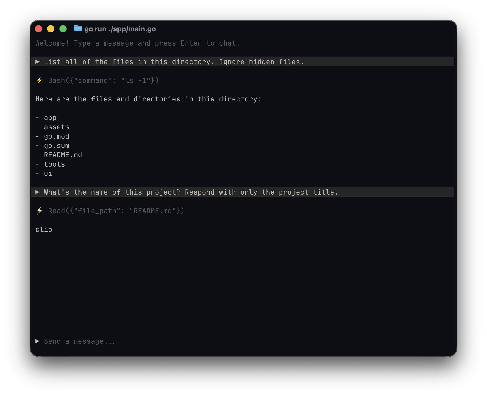

# clio

A terminal-based coding assistant built in Go. Clio provides an interactive chat UI right in your terminal, backed by an LLM with tool use via OpenRouter. It can read and write files, execute shell commands, and iterate on code — acting as a pair programmer that lives in your terminal.



## Setup

```sh
export OPENROUTER_API_KEY="your-key-here"
```

## Usage

```sh
go run ./app
```

Type a message and press Enter to chat. Ctrl+C to quit.

## Configuration

| Variable              | Default                        | Description             |
|-----------------------|--------------------------------|-------------------------|
| `OPENROUTER_API_KEY`  | *(required)*                   | Your OpenRouter API key |
| `OPENROUTER_BASE_URL` | `https://openrouter.ai/api/v1` | API base URL            |
| `CLIO_MODEL`          | `anthropic/claude-haiku-4.5`   | Model to use            |

## Tools

| Tool  | Description                           |
|-------|---------------------------------------|
| Read  | Read file contents                    |
| Write | Write content to a file               |
| Bash  | Execute a shell command (30s timeout) |
